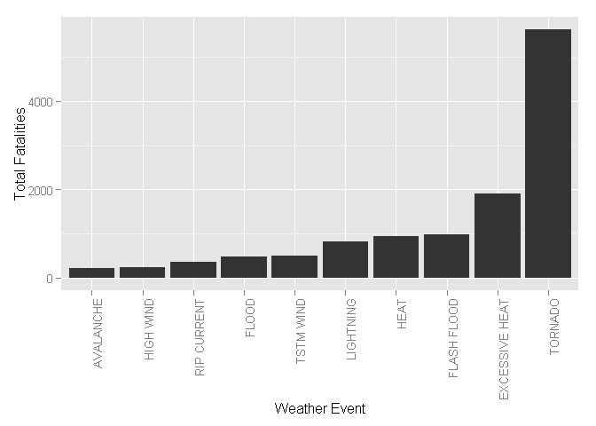
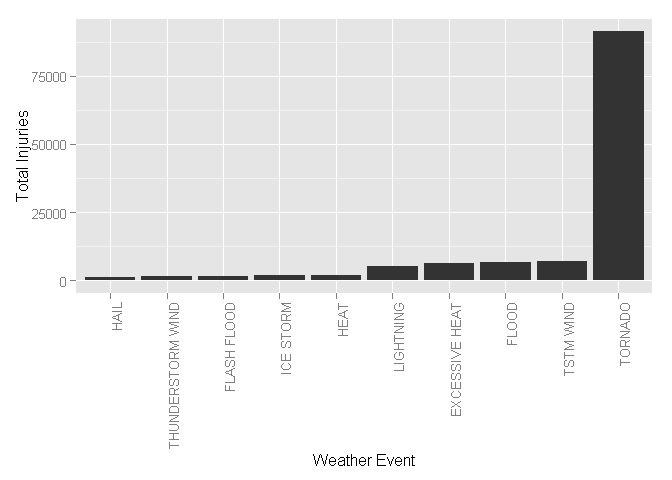
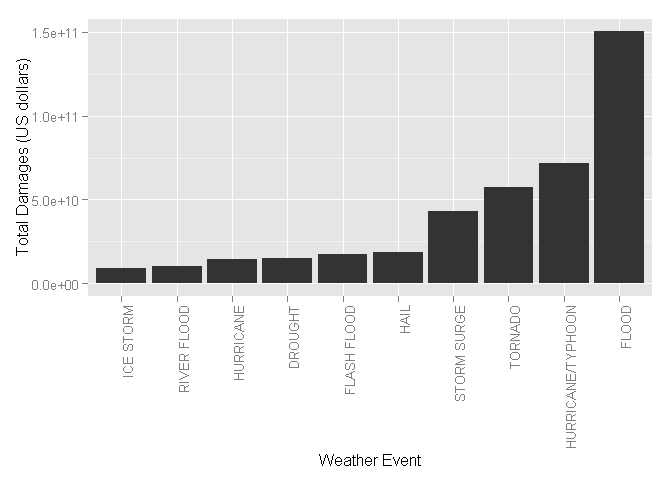

# Analysis of NOAA Storm Database: Economic and human costs of severe weather

## Synopsis 

The goal of this data analysis was to address the following questions:

1.	Across the United States, which types of weather events are most harmful with respect to population health?
1.	Across the United States, which types of weather events have the greatest economic consequences?

This document describes the steps taken in the data processing of the NOAA Strom Database, as well as the analysis of the results.  In short, two types of severe weather events stick out, Tornado because of their high rate of fatalities, and flooding for economic damage.


## Data Processing

```r
#load libraries
library(ggplot2)
```

```
## Warning: package 'ggplot2' was built under R version 3.2.2
```


```r
# download file
if (!file.exists("StormData.csv.bz2")) {
  download.file("https://d396qusza40orc.cloudfront.net/repdata%2Fdata%2FStormData.csv.bz2"
                ,"StormData.csv.bz2")
}

storm_data <- read.csv(bzfile('StormData.csv.bz2'), header=TRUE, stringsAsFactors = FALSE)
```

## Results


```r
reduced_fatal = aggregate(storm_data$FATALITIES,by=list(storm_data$EVTYPE),FUN=sum, na.rm=TRUE)
result_fatal <- head(reduced_fatal[order(reduced_fatal$x, decreasing=TRUE),], 10)


ggplot(data=result_fatal, aes(x=reorder(result_fatal$Group.1, result_fatal$x), y=result_fatal$x)) + 
  geom_bar(stat="identity") + xlab("Weather Event") + ylab("Total Fatalities") + 
  theme(axis.text.x = element_text(angle = 90, hjust = 1)) 
```

 


```r
reduced_injury = aggregate(storm_data$INJURIES,by=list(storm_data$EVTYPE),FUN=sum, na.rm=TRUE)
result_injury <- head(reduced_injury[order(reduced_injury$x, decreasing=TRUE),], 10)

ggplot(data=result_injury, aes(x=reorder(result_injury$Group.1, result_injury$x), y=result_injury$x)) + 
  geom_bar(stat="identity") + xlab("Weather Event") + ylab("Total Injuries") + 
  theme(axis.text.x = element_text(angle = 90, hjust = 1)) 
```

 


```r
exp <- c("B", "b", "M", "m", "K", "k", "H", "h")
exp_v <- c( H=10^2, h=10^2, M=10^6, m=10^6, K=10^3, k=10^3, B=10^9, b= 10^9)
titles <- c("EventType", "Damage", "Multipler")

prop_set <- subset(storm_data, storm_data$PROPDMGEXP %in% exp)
prop_tmp <- prop_set[, c("EVTYPE", "PROPDMG", "PROPDMGEXP")]
colnames(prop_tmp) <- titles

crop_set <- subset(storm_data, storm_data$CROPDMGEXP %in% exp)
crop_tmp <- crop_set[, c("EVTYPE", "CROPDMG", "CROPDMGEXP")]
colnames(crop_tmp) <- titles

# Add together the prop + crop
tmp_result <- rbind(crop_tmp, prop_tmp)
tmp_result$total_dollars <- tmp_result$Damage * exp_v[tmp_result$Multipler]

reduced_damage = aggregate(tmp_result$total_dollars ,by=list(tmp_result$EventType),FUN=sum)
result_damage <- head(reduced_damage[order(reduced_damage$x, decreasing=TRUE),], 10)

ggplot(data=result_damage, aes(x=reorder(result_damage$Group.1, result_damage$x), y=result_damage$x)) + 
  geom_bar(stat="identity") + xlab("Weather Event") + ylab("Total Damages (US dollars)") + 
  theme(axis.text.x = element_text(angle = 90, hjust = 1)) 
```

 
